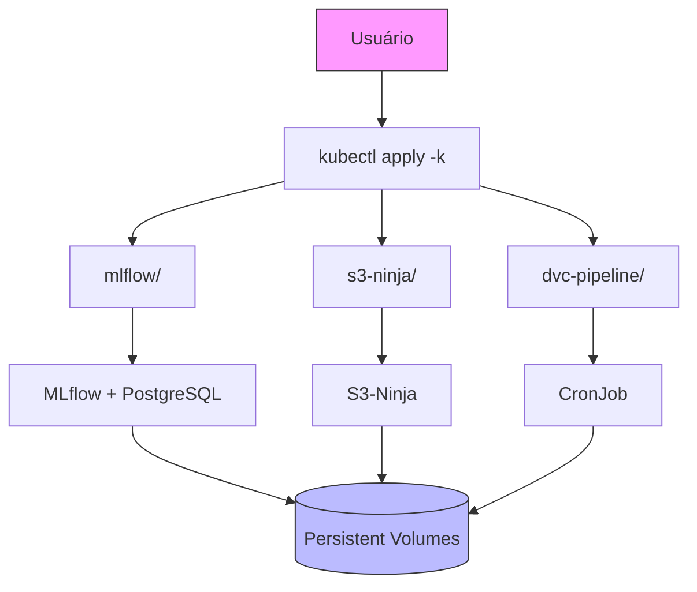

### Manual Técnico: Repositório de Infraestrutura Kubernetes para MLOps  

#### **Descrição**  
Este repositório define a infraestrutura Kubernetes para orquestrar serviços e pipelines de MLOps em ambientes de produção. Ele encapsula configurações para implantação automatizada de serviços essenciais (MLflow para rastreamento de modelos, S3-Ninja para armazenamento) e pipelines de dados (ingestão, treinamento e validação), garantindo escalabilidade e gestão centralizada de recursos.

---

### **Principais Funcionalidades**  
*   **Implantação de Serviços Essenciais**: Configurações prontas para MLflow (rastreamento de modelos), PostgreSQL (banco de dados) e S3-Ninja (armazenamento compatível com S3).
*   **Pipeline de Dados Automatizado**: CronJobs para execução agendada de ingestão de dados, treinamento de modelos e validação.
*   **Gestão de Segurança Integrada**: Namespaces isolados e secrets centralizados para credenciais sensíveis (AWS, WandB, MLflow).
*   **Armazenamento Persistente**: Configuração de Persistent Volume Claims (PVCs) para bancos de dados e artefatos de modelos.
*   **Monitoramento de Recursos**: Definição de limites de CPU/GPU e políticas de reinício para tolerância a falhas.

---

### **Público-Alvo Primário**  
*   **Engenheiros de DevOps/MLOps**: Responsáveis por implantar e manter pipelines em Kubernetes.
*   **Administradores de Infraestrutura**: Gestão de clusters, redes e políticas de segurança.
*   **Cientistas de Dados**: Consumidores dos serviços de MLflow e armazenamento S3.

---

### **Natureza do Projeto**  
**Infraestrutura como Código (IaC)** para ambientes de MLOps, operando como um **MVP para produção** com as seguintes características:  
*   Configurações versionadas e implantáveis via Kustomize.
*   Integração nativa com ferramentas do ecossistema MLOps (DVC, MLflow, WandB).
*   Modularidade para adaptação em ambientes locais ou cloud.
*   Foco em reprodutibilidade e gestão de ciclo de vida de modelos.

---

### **Ressalvas Importantes**  
1.  **Uso Local vs. Nuvem**:  
    - S3-Ninja é para desenvolvimento. Substitua por AWS S3/Azure Blob Storage em produção.
2.  **Segurança**:  
    - Secrets são armazenados como *stringData* (não criptografados). Use HashiCorp Vault em produção.
3.  **Escalabilidade**:  
    - Limites de GPU/CPU podem exigir ajustes conforme tamanho do cluster.
4.  **Monitoramento**:  
    - Não inclui ferramentas avançadas (Prometheus/Grafana) no escopo atual.

---

### **Visão de Projeto**  
#### **Cenário Positivo 1: Implantação Ágil para Novas Equipes**  
**Persona:** Dra. Sofia, Líder de MLOps.  
**Contexto:** Sofia precisa implantar um ambiente completo de MLOps para um novo time de pesquisa em um cluster Kubernetes existente.  

**Narrativa:** Sofia clona o repositório e aplica as configurações com três comandos. Em minutos, os serviços de MLflow e S3-Ninja estão operacionais. O pipeline de dados é agendado para executar diariamente, ingerindo novos datasets e treinando modelos automaticamente. A equipe de pesquisa acessa o MLflow via navegador para acompanhar experimentos, sem necessidade de configuração manual.  

#### **Cenário Positivo 2: Recuperação de Falhas com Rollback Automático**  
**Persona:** Diego, Engenheiro de DevOps.  
**Contexto:** Uma atualização de modelo causa degradação de performance não detectada nos testes iniciais.  

**Narrativa:** O sistema de monitoramento detecta anomalias nas métricas via API do MLflow. Diego aciona o job de validação, que compara automaticamente o modelo problemático com a versão estável em produção. Identificada a regressão, o sistema reverte para a versão anterior e notifica a equipe de pesquisa via logs centralizados, minimizando o tempo de indisponibilidade.  

#### **Cenário Negativo: Armadilha de Compatibilidade de Dependências**  
**Persona:** Carla, Engenheira de MLOps.  
**Contexto:** Um modelo treinado com bibliotecas atualizadas falha ao ser implantado em um nó do Kubernetes com versões antigas.  

**Narrativa:** O pipeline registra o modelo no MLflow com sucesso, mas os pods de produção falham ao carregá-lo. Carla gasta horas rastreando conflitos entre versões de PyTorch, percebendo que o sistema não verifica compatibilidade de dependências durante o registro do modelo. A falha expõe a necessidade de integração de checagens de ambiente no fluxo.  

#### **Cenário Negativo: Descompasso na Configuração de Storage**  
**Persona:** Eduardo, Administrador de Infraestrutura.  
**Contexto:** Alterações nos PVCs causam perda de acesso aos volumes persistentes após uma atualização de cluster.  

**Narrativa:** Eduardo atualiza as políticas de storage do Kubernetes sem ajustar as configurações dos PVCs existentes. Os jobs falham ao acessar dados históricos, e modelos em produção tornam-se inacessíveis. A recuperação exige intervenção manual e horas de downtime, destacando a fragilidade na gestão de volumes entre ambientes.  

---

### **Documentação Técnica**  
#### **1. Especificação de Requisitos**  
**Funcionais**:  
*   **RF01**: Implantar MLflow com PostgreSQL e Minio.  
*   **RF02**: Provisionar armazenamento S3 via S3-Ninja.  
*   **RF03**: Executar pipelines DVC como CronJobs.  
*   **RF04**: Gerenciar secrets via RBAC.  
*   **RF05**: Garantir persistência de dados com PVCs/PVs.  

**Não-Funcionais**:  
*   **RNF01**: Escalabilidade horizontal (MLflow).  
*   **RNF02**: Tolerância a falhas (`restartPolicy: OnFailure`).  
*   **RNF03**: Isolamento de recursos via namespaces.  
*   **RNF04**: Configuração via variáveis de ambiente.  

---

#### **2. Arquitetura e Modelo de Implantação**  


---

#### **3. Fluxos de Trabalho**  
**Implantação Completa**:  
1.  Aplicar configurações do MLflow.  
2.  Implantar serviço S3-Ninja.  
3.  Configurar pipeline DVC como CronJob.  

**Recuperação de Falhas**:  
1.  Monitorar métricas via MLflow API.  
2.  Acionar validação comparativa.  
3.  Reverter automaticamente se necessário.  

---

#### **4. Sobre o Código e Implementação**  
**Linguagens e Ferramentas**:  
- **Kubernetes**: Orquestração de contêineres.  
- **Kustomize**: Gerenciamento declarativo de configurações.  
- **Docker**: Empacotamento de ambientes (imagens em `mlflow/Dockerfile`).  

**Estrutura de Pastas**:  
```bash
.
├── dvc-pipeline/             # Pipeline de dados
│   ├── configmap.yaml        # Endpoint S3
│   ├── cronjob.yaml          # Agendamento
│   └── secrets.yaml          # Credenciais
├── mlflow/                   # Serviço MLflow
│   ├── mlflow-deployment.yaml
│   └── postgres-pvc.yaml
└── s3-ninja/                 # Serviço S3
    ├── deployment.yaml
    └── pvc.yaml
```

**Boas Práticas**:  
1.  **Separação de Ambientes**: Namespaces isolados (`mlflow`, `s3-ninja`).  
2.  **Gestão de Secrets**: Armazenamento centralizado com RBAC.  
3.  **Versionamento**: Todas as configurações versionadas no Git.  

---

### **Manual de Utilização**  
#### **1. Implantação Inicial**  
```bash
kubectl apply -k mlflow/
kubectl apply -k s3-ninja/
kubectl apply -k dvc-pipeline/
```

#### **2. Verificação de Serviços**  
```bash
kubectl get pods -n mlflow
kubectl logs -n dvc-pipeline <pod-name>
```

#### **3. Execução Manual do Pipeline**  
```bash
kubectl create job --from=cronjob/dvc-pipeline-scheduled manual-run -n dvc-pipeline
```

#### **4. Atualização de Secrets**  
```bash
kubectl edit secret -n dvc-pipeline dvc-pipeline-secrets
```

---

### **Solução de Problemas Comuns**  
| Problema                          | Ação Recomendada                                                                 |
|-----------------------------------|---------------------------------------------------------------------------------|
| **PVC pendente**                  | Verificar `storageClassName` no PV/PVC.                                         |
| **Falha na conexão S3**           | Validar `endpoint_url` em `dvc-pipeline/configmap.yaml`.                        |
| **MLflow não inicia**             | Checar logs do PostgreSQL (`kubectl logs -n mlflow <postgres-pod>`).            |
| **Job travado**                   | Aumentar `backoffLimit` ou ajustar limites de CPU/GPU no `job.yaml`.           |

---
